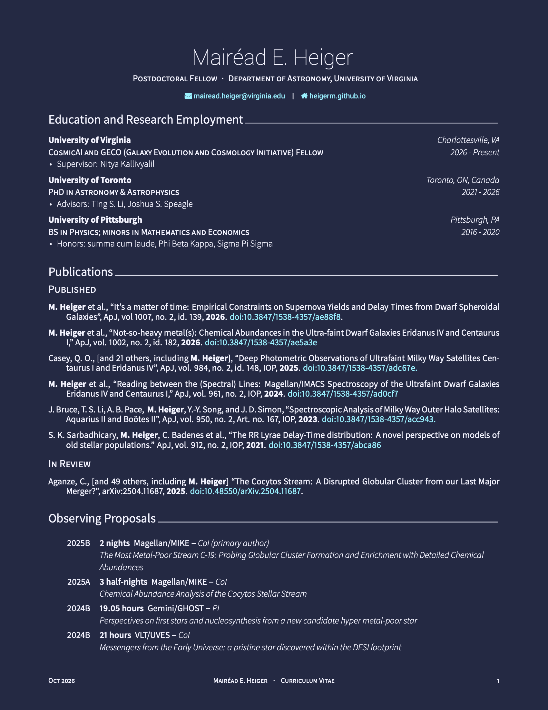
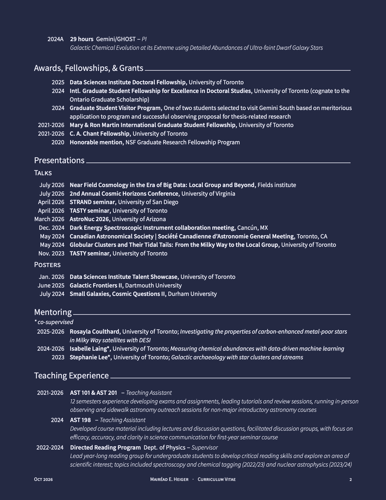
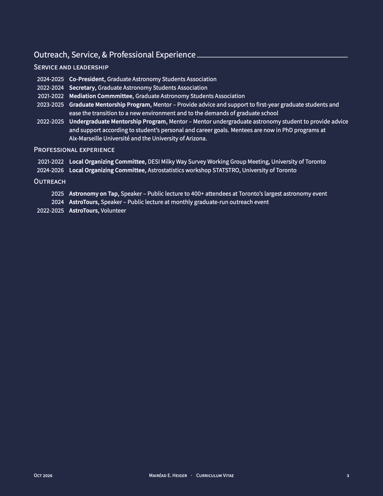

  <section id="one">
    

      <header class="major">
          <h1>CV</h1>
      </header>
    
      

        

          

            
              
            
          

      
          

            
              
            
          

      
          

            
              
            
          

        

      

  
    

  </section>

<!-- <embed src="assets/images/academic_cv_2026-website.pdf"/> -->
